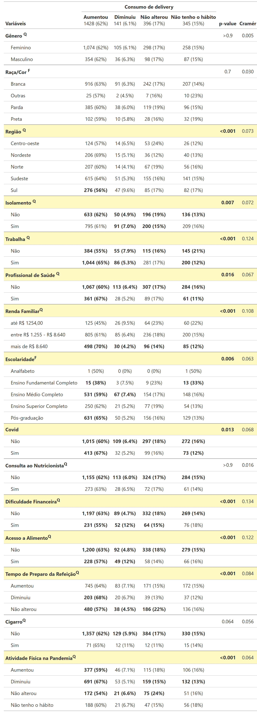
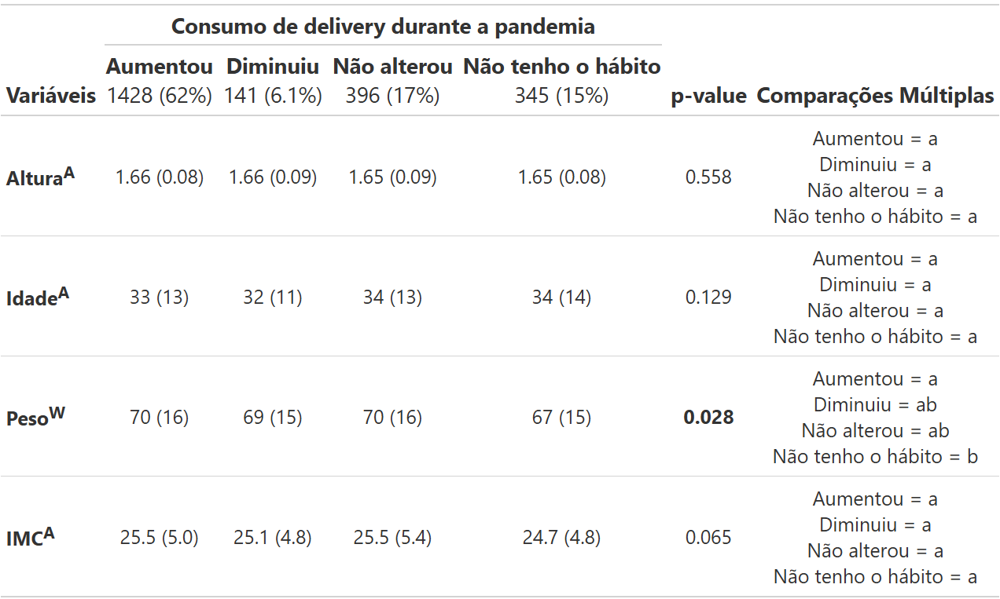
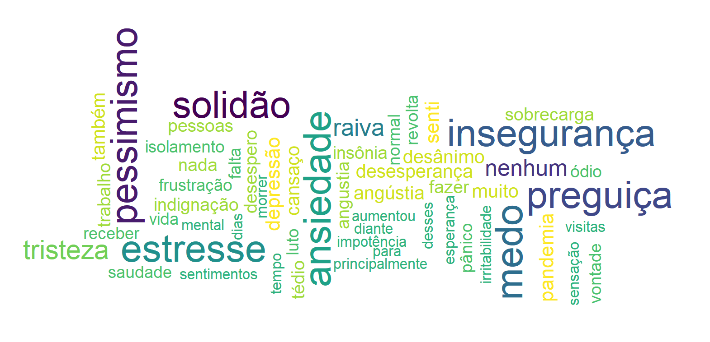

# **INTRODUÇÃO**{data-background-image="Nuticao.png" style="text-align:center"}

## Contextualização do tema{.scrollable}

 

Pandemia de COVID-19 provocou mudanças:

:::: columns

::: {.column width="50%"}
::: box-blue
**Sociais**
:::

::: box-purple
**Econômicas**
:::
:::

::: {.column width="50%"}
::: box-purple
**Emocionais**
:::

::: box-blue
**Comportamentais**
:::
:::

::::

  
 

Alterações na rotina:

:::: columns

::: {.column width="50%"}
::: box-blue
**Isolamento social**
:::

::: box-purple
**Trabalho remoto**
:::
:::

::: {.column width="50%"}
::: box-purple
**Insegurança alimentar**
:::

::: box-blue
**Mudanças na prática de atividade física**
:::
:::

::::

 

**Impacto potencial sobre hábitos alimentares.**

## Problema de Pesquisa
 

Essa pesquisa explora como a COVID-19 influenciou a nutrição dos indivíuos com relação a:

1) Mudanças alimentares
2) Fatores socioeconômicos e emocionais
3) Nível de autocuidado

::: box-orange
A variável resposta central do nosso estudo é: **Delivery**
:::

## Objetivos {.scrollable}

 

**Objetivo Geral**

- Avaliar a associação entre a variável resposta selecionada e as demais variáveis do banco de dados.

 

**Objetivos Específicos:**

- Identificar padrões de mudança alimentar;
- Investigar fatores associados:
  - renda;
  - escolaridade;
  - isolamento;
  - atividade física;
  - acesso aos alimentos;
  - sentimentos durante a pandemia;
- Explorar desigualdades sociais relacionadas à alimentação.

# **METODOLOGIA**{data-background-image="Nuticao.png" style="text-align:center"}

## Delineamento do Estudo

**Informações:**

- Estudo observacional transversal
- Dados coletados em 2022
- Questionário online
- Contexto: Pândemia de COVID-19

 

**Amostra:** 2310 indivíduos

 

**Origem dos dados:** Pós-graduação em Nutrição - UFF

## Variáveis do Estudo {.scrollable}

 

:::: columns

::: {.column width="50%"}

- **Variáveis Categóricas**
  - Gênero;
  - Raça/cor;
  - Região;
  - Isolamento;
  - Trabalha;
  - Profissional da Saúde
  - Renda familiar;
  - Escolaridade;
  - Diagnóstico de COVID-19;
  - Consulta com nutricionista;
  - Dificuldadefinanceira;
  - Acesso a alimenmto;
  - Tempo de preparo da refeição;
  - Hábito de fumar;
  - Atividade física.

:::

::: {.column width="50%"}
- **Variáveis Quantitativas**
  - Idade;
  - Altura;
  - Peso;
  - IMC.

  

- **Variável Aberta**
  - sentimentos durante a pandemia.
  
 

- **Variável Resposta**
  - Delivery

:::

::::

## Análises Estatísticas
 

:::: columns

::: {.column width="50%"}

**Variáveis Qualitativas:**

- Tabelas de contingência;
- Frequências absolutas;
- Frequências relativas (% por linha).

 

**Testes de Associação:**

- Teste Qui-Quadrado de Pearson;
- Teste Exato de Fisher (quando necessário).

:::

::: {.column width="50%"}
**Medida de Associação:**

- V de Cramér:

 
**Caselas Influentes:**

- Resíduos padronizados
:::

::::

# **Resultados**{data-background-image="Nuticao.png" style="text-align:center"}

## **Variáveis Categóricas**{.scrollable}
 
{fig-align="center" width=100%}

## **Variáveis Contínuas**{.scrollable}
 
{fig-align="center" width=100%}

## **Nuvem de palavras**

{fig-align="center" width=100%}

# **Resultados**{data-background-image="Nuticao.png" style="text-align:center"}

## Variáveis categóricas

 

- Predominou o aumento do consumo de delivery durante a pandemia (62%).
- Houve associação significativa com região, trabalho, renda, escolaridade, isolamento, COVID-19, dificuldade financeira, acesso a alimentos, preparo das refeições e atividade física (p < 0,05).
- As associações encontradas apresentaram magnitudes fracas (V de Cramér baixo).
- Trabalhadores e profissionais da saúde apresentaram maior frequência de aumento no consumo de delivery.
- Maior renda e maior escolaridade estiveram associadas a maior aumento do consumo.
- Dificuldade financeira e dificuldade de acesso a alimentos estiveram associadas à diminuição do consumo.
- Redução da atividade física durante a pandemia esteve associada ao aumento do consumo de delivery.

## Variáveis Contínuas

 

- Não houve diferenças significativas entre os grupos para altura (ANOVA; p = 0,558), idade (ANOVA; p = 0,129) e IMC (ANOVA; p = 0,065).
- Houve diferença significativa apenas para peso corporal (ANOVA de Welch; p = 0,028).
- Nas comparações múltiplas, participantes sem hábito de consumir delivery apresentaram menor peso médio em relação ao grupo que aumentou o consumo.
- Os grupos que diminuíram ou mantiveram o consumo apresentaram médias intermediárias, sem diferença estatística dos demais grupos.
- De forma geral, as variáveis antropométricas mostraram pouca variação entre os padrões de consumo de delivery durante a pandemia.

## Variável Aberta

 

Os sentimentos durante a pandemia foram majoritariamente negativos, trazendo a noção do peso que se tornou os efeitos da pandemia na vida das pessoas de maneira geral. 

# **Obrigada!**{data-background-image="Nuticao.png" style="text-align:center"}